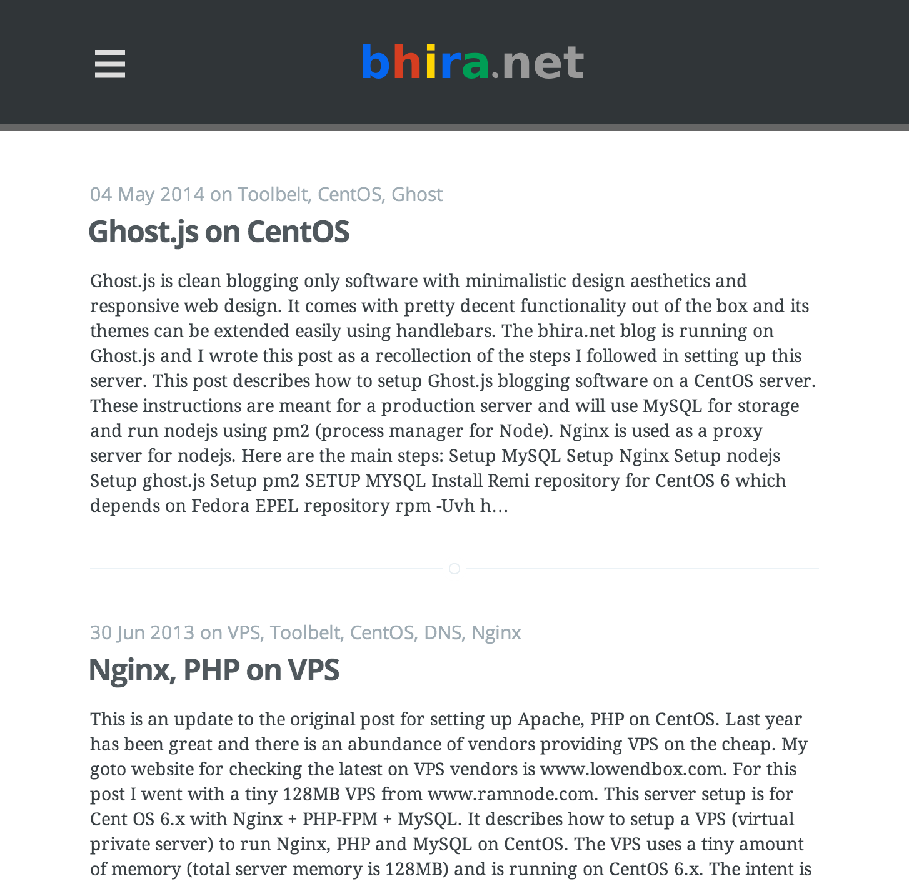
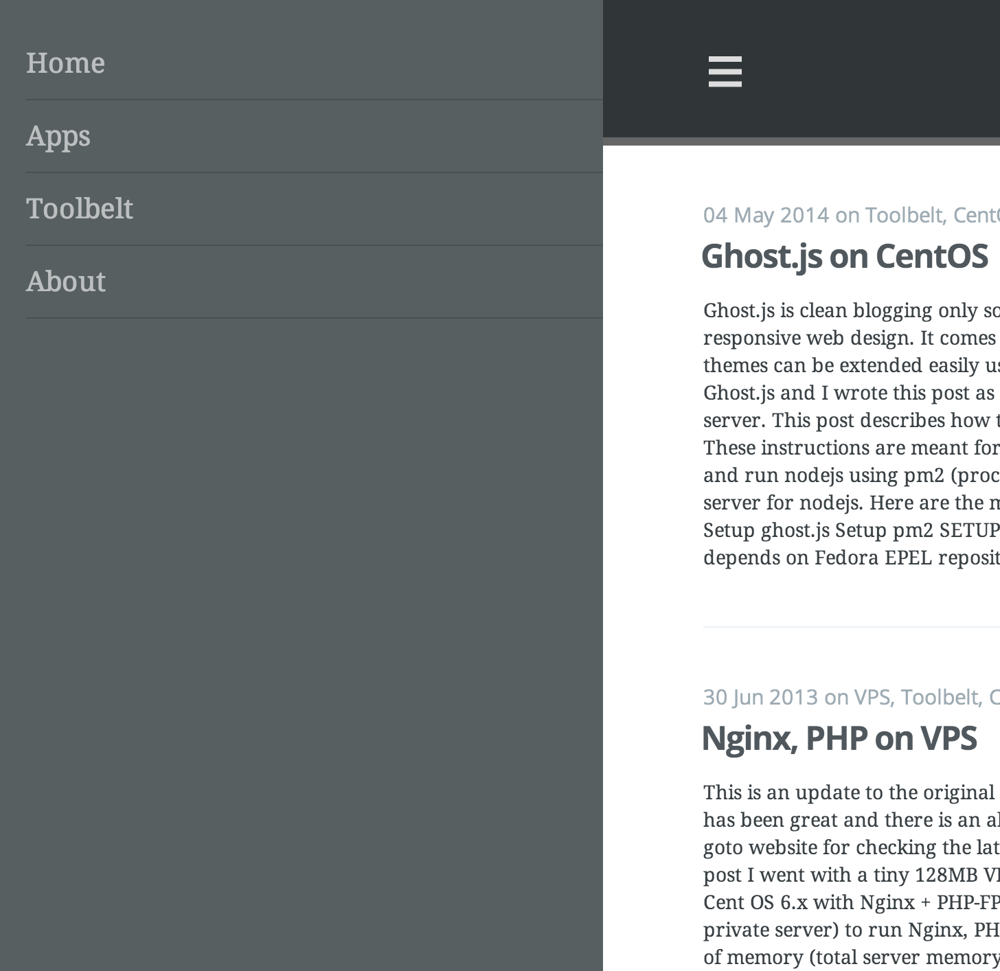

casper-slidr
============

Casper-Slidr is a theme for Ghost.js blogging platform. It is derived from the default Casper theme that comes as part of Ghost.js installation, hence the name...


#### THEME FEATURES
* Simple, clean header for pages and posts
* Sliding menu for all pages and posts using [jquery.mmenu](http://mmenu.frebsite.nl/)
* Support for [Disqus](http://disqus.com/) comments in posts
* Syntax highlighting for code using [google-code-prettify](https://code.google.com/p/google-code-prettify/)
* Page view tracking using [Google Analytics](http://www.google.com/analytics/)


You can see casper-slidr theme in action at [http://bhira.net](http://bhira.net).  If you would like to read more about how the different features were incorporated into the theme, take a look at this [blog post](http://bhira.net/casper-slidr-theme-for-ghost-js/).


#### HOW TO INSTALL THEME?
* Copy casper-slidr.zip to ```<ghost install dir>/content/themes```
* unzip casper-slidr.zip
* Edit ```casper-slidr/default.hbs```
	* Set width/height for 'blog-logo' style, based on the your blog logo
	* Customize the list entries under 'my-menu' to your liking
	* Remember to create the corresponding ghost pages
	* Set your Google Analytics Account Number instead of UA-XXXXXXX-X
* Edit ```casper-slidr/post.hbs```
	* Set disqus_shortname value to your blog instead of XXXXX
* Copy your favicon to ```casper-slidr/assets/images/favicon.png```


#### SCREENSHOTS
<a href="http://bhira.net"></a>

<a href="http://bhira.net"></a>


#### HOW TO BUILD FROM SOURCE?
* Install git
* Install node js
* Install grunt-cli
* Clone casper-slidr repository from github
* Use npm to install all dependent node modules
* Run grunt to build the project

```
brew install git
brew install node
npm install -g grunt-cli
git clone https://github.com/baldeephira/casper-slidr.git
cd casper-slidr
npm install
grunt
```
